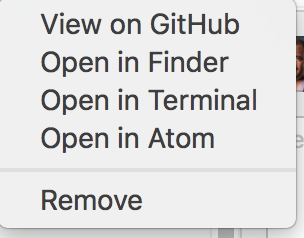

+++
title = "Anaconda"
description = ""
weight = 10
+++

### Step 2: Install and Configure Anaconda
We will be using Anaconda to provide a Jupyter environment for both R and Python.

Follow the following instructions to install Anaconda from [Continuum Analytics](https://www.continuum.io/).
[OSX](#osx)
[Windows](#windows)
[Linux](#linux)

Once you have the Anaconda Distribution, follow below for [advanced configuration](#advanced-configuration).

### OSX
1. Follow the online instructions to [install the Anaconda Distribution with Python 3.6](https://docs.continuum.io/anaconda/install/mac-os)
2. Follow below for [advanced configuration](#advanced-configuration).

### Windows
Windows may often have issues associated with installation if you have had previous versions of Anaconda installed.  If it doesn't work, start by uninstalling everything

1. Follow the online instructions to [install the Anaconda Distribution with Python 3.6](https://docs.continuum.io/anaconda/install/windows)
2. Follow below for [advanced configuration](#advanced-configuration).

### Linux
If you are a Linux user, please help in supporting the class. You likely won't need my help. ;)
1. Follow the online instructions to [install the Anaconda Distribution with Python 3.6](https://docs.continuum.io/anaconda/install/linux)
2. Follow below for [advanced configuration](#advanced-configuration).


### Advanced Configuration

(a.) Change directories to the `techfundamentals-fall2017-materials` folder you cloned earlier.

```
$ cd <insert full path >\techfundamentals-fall2017-materials
```

Or from the Github Application right click on the repository name and click `Open in Terminal.`


(b.) create a new environment
```
$ conda env create -f environment.yml
```

(c.) Now we can activate the new AD environment. If you shut down your terminal you will have to do this each time.
```
$ source activate ad
```

(d.) Launch a Jupyter notebook with the command:
```
$ jupyter notebook
```
